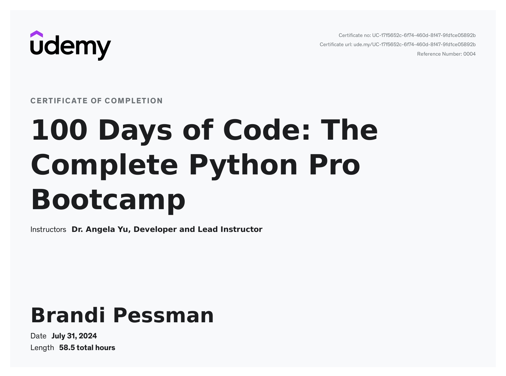

# 100 Days of Code: The Complete Python Pro Bootcamp via Udemy

Through 100 days of intensive python training, I learned:

- automation
- game, app, and web development
- data science
- machine learning

With practice in the following packages:

- Selenium
- Beautiful Soup
- Request
- Flask
- Pandas
- NumPy
- Scikit Learn
- Plotly
- Matplotlib